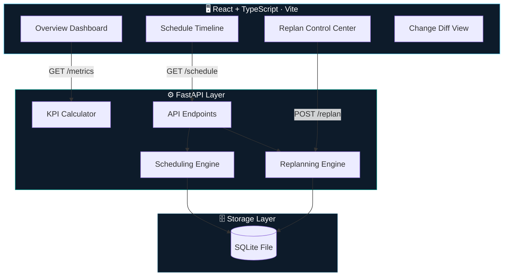
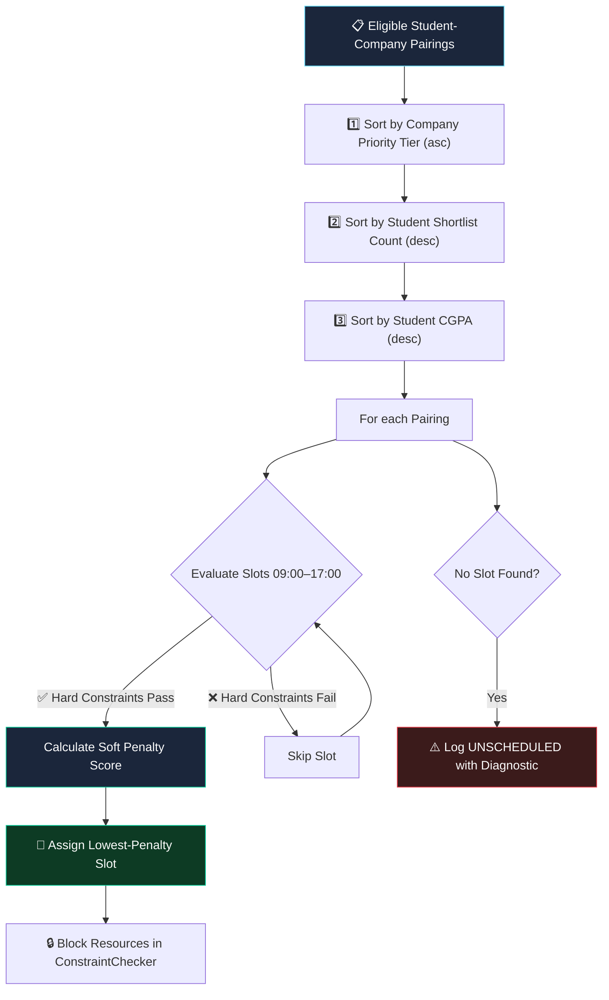
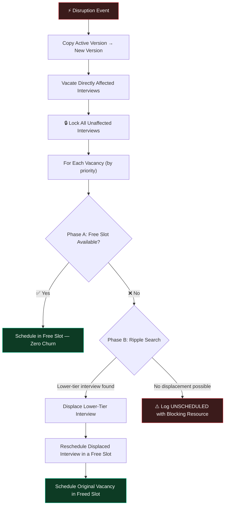

<div align="center">

# 🗓️ Placement Week Scheduling & Replanning System

### A deterministic, minimal-churn scheduler for campus placement week

*Software Developer Intern Technical Assessment — Mirai Labs*


</div>

<br>

> **Candidate:** Saadhan P &nbsp;•&nbsp; **Role:** Software Developer Intern — Mirai Labs &nbsp;•&nbsp; **Date:** August 29, 2026

A system that replaces error-prone whiteboard-based scheduling with a **deterministic scheduling engine** and a **real-time, minimal-churn replanning utility** — built to handle late company arrivals, dropped panels, withdrawn students, and room outages without cascading chaos across the rest of the schedule.

<br>

## 📊 At a Glance

<div align="center">

| 🎯 Determinism | ⚡ Churn Control | 🏗️ Architecture | ✅ Test Coverage |
|:---:|:---:|:---:|:---:|
| 100% reproducible | Bounded to 1 displacement | Clean Architecture | Full integration suite |

</div>

<br>

## 📌 Table of Contents

| | | |
|---|---|---|
| [**1.**](#1--system-architecture) System Architecture | [**2.**](#2--repository-structure) Repository Structure | [**3.**](#3--getting-started) Getting Started |
| [**4.**](#4--core-algorithms) Core Algorithms | [**5.**](#5--key-metrics--rationale) Key Metrics | [**6.**](#6--live-technical-defense-preparation) Defense Prep Q&A |

---

## 1. 🏛️ System Architecture

The application follows **Clean Architecture** principles — a modular Python backend, a responsive React frontend, and strict separation of concerns.



### 🧩 Backend Module Map

| Module | File | Responsibility |
|:---|---|---|
| 🗃️ **Models** | `models/models.py` | DB entities — Student, Company, Room, Interview, ScheduleVersion, DisruptionEvent, ScheduleChange, Notification |
| 🧮 **Scheduler** | `scheduler/engine.py` | Deterministic scheduling heuristic (initial layout) |
| 🔁 **Replanner** | `replanner/engine.py` | Disruption-solving engine & minimal-churn heuristics |
| 📋 **Diff Engine** | `replanner/diff.py` | Version diffs, change logs, student/company/panel notifications |
| 📈 **Metrics** | `metrics/calculator.py` | KPI calculation — completion rate, utilization, waiting time, churn |

---

## 2. 📁 Repository Structure

```
placement-week-scheduler/
├── 📂 backend/
│   ├── 📂 app/
│   │   ├── 📂 api/               → FastAPI REST endpoints
│   │   ├── 📂 models/            → SQLAlchemy DB entities
│   │   ├── 📂 schemas/           → Pydantic request/response schemas
│   │   ├── 📂 scheduler/         → Hard & soft constraint validator + greedy scheduler
│   │   ├── 📂 replanner/         → Disruption event solvers + diff log generator
│   │   ├── 📂 metrics/           → KPI calculator (completion, wait time, utilization, churn)
│   │   ├── 📄 database.py        → SQLAlchemy SQLite connection setup
│   │   └── 📄 main.py            → FastAPI application entrypoint
│   └── 📄 requirements.txt       → Python requirements
├── 📂 frontend/
│   ├── 📂 src/
│   │   ├── 📄 App.tsx            → Main dashboard layout and state controller
│   │   ├── 📄 index.css          → Global glassmorphic stylesheet
│   │   └── 📄 main.tsx           → Vite entrypoint
│   └── 🐳 Dockerfile
├── 📂 scripts/
│   ├── 📄 generate_data.py       → Seeded synthetic data generator (students, rooms, companies)
│   └── 📄 generate_schedule.py   → Runs initial schedule generation from CLI
├── 📂 tests/                     → Pytest unit & integration tests
└── 🐳 docker-compose.yml         → Runs application inside containers
```

---

## 3. 🚀 Getting Started

> **Prerequisites:** Python **3.10+** &nbsp;&nbsp;•&nbsp;&nbsp; Node.js **18+**

### 🅰️ Option A — Local Setup

<table>
<tr><td>

**Step 1 · Backend**

```bash
# Create & activate virtual environment
python3 -m venv venv
source venv/bin/activate

# Install requirements
pip install -r backend/requirements.txt

# Seed the database — 800 students, 35 companies, 20 rooms, 4 days (seed: 42)
python scripts/generate_data.py --seed 42

# Generate the initial schedule (Version 1)
python scripts/generate_schedule.py

# Run FastAPI backend
python backend/app/main.py
```

📍 Backend → **`http://localhost:8000`**  
📍 Swagger docs → **`http://localhost:8000/docs`**

</td></tr>
<tr><td>

**Step 2 · Frontend**

```bash
cd frontend
npm install
npm run dev
```

📍 Dashboard → **`http://localhost:5173`**

</td></tr>
</table>

### 🅱️ Option B — Docker Compose

```bash
docker compose up --build
```

| Service | URL |
|:---|---|
| 🖥️ Frontend | `http://localhost:5173` |
| ⚙️ Backend | `http://localhost:8000` |

### 🧪 Running Tests

```bash
PYTHONPATH=. venv/bin/pytest
```

---

## 4. 🧠 Core Algorithms

### 4.1 Initial Scheduling — Deterministic Greedy Heuristic

> A deterministic search (not MILP / GA / ML) ensures results are **100% reproducible** and every placement decision is explainable to a coordinator or student.



**Sorting key:**

$$\text{Key}(student, company) = (Tier_{comp},\ -Shortlists_{student},\ -CGPA_{student})$$

| Factor | Direction | Rationale |
|:---|:---:|:---|
| Company Tier | ↑ ascending | Tier-1 companies schedule first to secure slots |
| Shortlist Count | ↓ descending | Heavily-shortlisted students scheduled early to avoid downstream blockages |
| CGPA | ↓ descending | Highly qualified students prioritized within a company's selection |

**🔒 Hard constraints** *(must never be violated)*

- No student conflicts — no overlapping interviews
- No room conflicts — ≤ 1 interview per room at a time
- No panel conflicts — a panel can't run two interviews at once
- Company availability — working hours + preferred days
- Student eligibility — CGPA ≥ company cutoff, no withdrawn students

**⚖️ Soft penalty** *(ranks the valid slots)*

$$\text{Penalty} = (Gap_{waiting} \times 0.1) + (\text{RoomChange} \times 15.0) + (Start_{mins} \times 0.01)$$

- Minimizes student waiting time between interviews
- Penalizes room-switching (15-point penalty)
- Prefers earlier slots in the day (small 0.01 tiebreaker)

### 4.2 Replanning — Minimal-Churn Ripple Heuristic

> When a disruption occurs, the engine isolates the impact and **locks everything else in place**.



| Phase | Behavior | Churn Impact |
|:---|---|:---:|
| **A — Zero Churn** | Try a completely free, valid slot first | `0` |
| **B — Ripple Search** | Displace a *lower-priority* interview into a free slot | `1` |
| **Fallthrough** | Mark `UNSCHEDULED`, log the exact blocking resource | — |

🗂️ **Versioning:** Every replan copies the active schedule to a new version (`V1 → V2 → V3 …`), so sequential disruptions stack cleanly with full history.

---

## 5. 📈 Key Metrics & Rationale

| Metric | Formula | Why It Matters |
|:---|---|---|
| 🎯 **Completion Rate** | $\dfrac{\text{Scheduled Interviews}}{\text{Total Eligible Interviews}} \times 100$ | Primary success indicator for the placement schedule |
| 🚫 **Active Student Clashes** | $\sum \text{Overlapping slots per student}$ | Must always be **0** — verifies physical feasibility |
| 🏢 **Room/Panel Utilization** | $\dfrac{\text{Occupied Minutes}}{\text{Total Capacity Minutes}} \times 100$ | Measures operational efficiency / idle interviewer time |
| ⏱️ **Avg. Student Waiting Time** | $\dfrac{\sum \text{Gaps between interviews per day}}{\text{Total student gaps}}$ | Soft-constraint quality — lower means less student fatigue |
| 🔄 **Replan Churn Rate** | $\dfrac{\text{Moved + Cancelled Appointments}}{\text{Prior Scheduled Count}} \times 100$ | Core replanning metric — low churn = less disruption chaos |

---

## 6. 🎤 Live Technical Defense Preparation

<table>
<tr><td width="60">🅠</td><td><b>Why this scheduling algorithm, not MILP/ML?</b></td></tr>
<tr><td>🅐</td><td>A deterministic greedy priority search guarantees 100% predictable, reproducible outcomes and can explain <i>exactly</i> why any interview was (or wasn't) placed — critical when a coordinator has to justify a plan to a student on the spot.</td></tr>
</table>

<table>
<tr><td width="60">🅠</td><td><b>Hard vs. soft constraints?</b></td></tr>
<tr><td>🅐</td><td>Hard: student/room/panel conflicts, CGPA eligibility, withdrawal exclusion. Soft: waiting time, room-change penalty, preferred-day placement.</td></tr>
</table>

<table>
<tr><td width="60">🅠</td><td><b>How is replan churn minimized?</b></td></tr>
<tr><td>🅐</td><td>Lock all unaffected interviews. Vacate only directly-affected ones. Search free slots first (Phase A); if none, perform a single-level displacement of a lower-tier interview (Phase B). This bounds maximum churn to the minimum required.</td></tr>
</table>

<table>
<tr><td width="60">🅠</td><td><b>What about multiple sequential disruptions?</b></td></tr>
<tr><td>🅐</td><td>The version-control system handles this naturally — each replan takes the latest active version and outputs a new one (V1 → V2 → V3 …), so disruptions stack without conflict.</td></tr>
</table>

<table>
<tr><td width="60">🅠</td><td><b>How would this scale to 10,000 students?</b></td></tr>
<tr><td>🅐</td><td>

1. Index schedules with interval/segment trees for $O(\log N)$ overlap queries instead of $O(N)$
2. Partition the scheduling space by company priority or branch/department to solve sub-problems in parallel
3. Move constraint-checker state into a fast in-memory store (e.g. Redis) for shared access across workers

</td></tr>
</table>

### 🎬 Live Defense Walkthrough

| Step | Action |
|:---:|---|
| **1** | **Simulate a disruption** via the Replan Control Center *(e.g., Company C001 delay = 180 min)* |
| **2** | **Highlight Replan Churn %** in the metrics panel — defend why locking unaffected schedules + 1-level displacement prevents on-campus chaos |
| **3** | **Audit the Diff Log** — show who moved, who was cancelled, and the Notifications list populated with targeted SMS/email alerts for students, companies, and panels |

<br>

<div align="center">

---

*Built with deterministic engineering, not black-box guessing.* ✨

</div>
