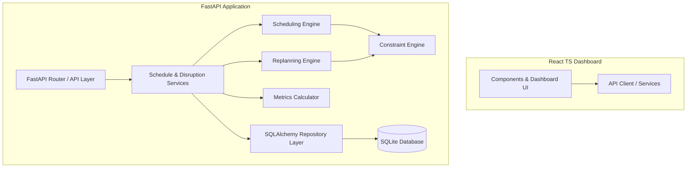
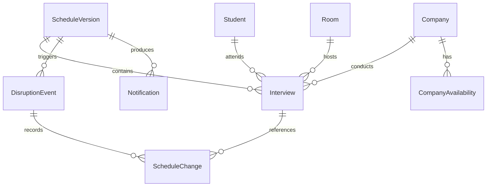

# Implementation Plan - Placement Week Scheduler & Replanning System

This plan outlines the architecture, data models, scheduling engine, replanning strategy, API design, and UI layouts to build a production-quality take-home assessment for a Software Developer Intern position.

---

## Technical Architecture & Stack

The application will use a clean, modular architecture separating the domain model, scheduling logic, database access, and API layer.

### Backend (Python)
- **Framework**: FastAPI (asynchronous, autogenerated OpenAPI docs)
- **Data Parsing/Validation**: Pydantic v2
- **ORM & DB**: SQLAlchemy 2.0 with SQLite (file-based database)
- **Testing**: pytest with pytest-cov for coverage and constraint verification

### Frontend (React + TypeScript)
- **Framework**: Vite + React + TypeScript + Tailwind CSS (Wait, user instructions say: "Avoid using TailwindCSS unless the USER explicitly requests it; in this case, first confirm which TailwindCSS version to use. Use Vanilla CSS for maximum flexibility and control.")
- **Styling**: Vanilla CSS with custom utility classes or scoped CSS modules for maximum flexibility and modern look.
- **Icons**: Lucide React
- **Timeline/Gantt Visuals**: HTML5 Canvas or pure CSS grid/flex timeline boards.

---

## Database Model & Entities

We will use SQLite with SQLAlchemy. The tables are normalized to track details and schedule versions:

1. **`Company`**: ID, name, priority_tier (1, 2, 3), cgpa_cutoff, interview_duration (minutes), panel_count, expected_shortlist_count, preferred_days (comma-separated).
2. **`Student`**: ID, name, branch, cgpa, graduation_year, shortlisted_companies (JSON/comma-separated IDs), placement_status (UNPLACED, PLACED, WITHDRAWN).
3. **`Room`**: ID, name, capacity, location, is_available.
4. **`CompanyAvailability`**: ID, company_id, day (1-4), start_time (minutes from day start, e.g., 540 for 9:00 AM), end_time (e.g., 1020 for 5:00 PM).
5. **`ScheduleVersion`**: ID (integer auto-increment), name (e.g., "Initial Schedule", "After C007 Delay"), created_at, is_active.
6. **`Interview`**: ID, version_id, student_id, company_id, panel_index (1 to company.panel_count), room_id, day, start_time (minutes from day start), end_time, status (SCHEDULED, UNSCHEDULED), failure_reason (if UNSCHEDULED).
7. **`DisruptionEvent`**: ID, timestamp, disruption_type (COMPANY_DELAY, PANEL_DROPOUT, STUDENT_WITHDRAWAL, ROOM_UNAVAILABLE), parameters (JSON string), old_version_id, new_version_id.
8. **`ScheduleChange`**: ID, disruption_event_id, interview_id, change_type (MOVED, CANCELLED, ADDED, UNCHANGED), old_start_time, old_room_id, old_panel, new_start_time, new_room_id, new_panel, reason, impact.
9. **`Notification`**: ID, version_id, recipient_type (STUDENT, COMPANY, PANEL, COORDINATOR), recipient_id, message, is_read.

---

## Scheduling & Replanning Engine

### 1. Representation of Time
We divide each of the 4 placement days into 15-minute intervals starting from `09:00` (540 mins) to `17:00` (1020 mins) to make the schedule clean, but support arbitrary interview durations (e.g., 30, 45, 60 mins). All times are stored as minutes from `00:00` of that day.

### 2. Constraints Engine
A validator module will check:
- **Hard Constraints**:
  - **Student Conflict**: A student's interviews cannot overlap: `not (start_a < end_b and start_b < end_a)` on the same day.
  - **Room Conflict**: A room cannot host overlapping interviews.
  - **Panel Conflict**: A company panel cannot conduct overlapping interviews.
  - **Company Panel Capacity**: Number of simultaneous interviews for a company <= available panels.
  - **Company Availability**: Interview must fit within company availability slots.
  - **Student Eligibility**: Student CGPA >= Company CGPA cutoff.
  - **Resource Availability**: Room must be active, and student must not be withdrawn.
- **Soft Constraints (for scoring slots)**:
  - Minimize student waiting time (gap between interviews).
  - Prefer company's preferred days.
  - Maximize room and panel utilization.
  - Minimize travel between rooms for students.

### 3. Initial Scheduling Algorithm (Deterministic Greedy with Priority)
1. Generate all candidate student-company interviews from student shortlists (filter by CGPA cutoff).
2. Rank these interviews based on:
   - Company Priority Tier (Tier 1 > Tier 2 > Tier 3).
   - Student Constraint Score (students with more shortlists sorted first, to ensure they can fit all their interviews).
   - Student CGPA (higher CGPA first).
3. For each candidate interview (in sorted order):
   - Find all feasible slots `(day, start_time, end_time)` within the company availability.
   - For each slot, find an available panel and an available room.
   - Calculate a penalty score for each candidate assignment:
     - Penalty = `10 * (is_preferred_day ? 0 : 1) + 2 * waiting_time_gap + travel_distance`
   - Assign the slot with the lowest penalty score.
   - If no feasible assignment exists, mark the interview as UNSCHEDULED with a detailed breakdown of blocking resources (e.g., student busy, rooms full, panels full, time exhausted).

### 4. Replanning Engine (Minimal-Churn Rescheduling)
We formulate replanning using an **Incremental Rescheduling Heuristic**:
1. When a disruption occurs, identify the set of **directly affected** interviews (e.g., scheduled in a room during its outage, scheduled for a company before its delayed arrival, or scheduled for a dropped panel).
2. Unschedule/vacate these interviews.
3. Keep all other interviews locked in their current slots.
4. Try to find alternative slots for the affected interviews:
   - For each affected interview (sorted by Company Priority and Student CGPA):
     - Try to schedule it in an empty, available slot (no churn!).
     - If no empty slot is available, search for a swap or displacement:
       - Find if we can move a lower-priority company's interview to a free slot to free up this slot.
       - Limit the search depth to 1-level displacement to prevent cascading churn.
5. If an interview still cannot be scheduled, mark it as UNSCHEDULED.
6. Create a new `ScheduleVersion` and record the diff in `ScheduleChange`.

---

## API Design (REST API)

FastAPI will serve the following JSON endpoints:

- `GET /api/companies` - List all companies.
- `GET /api/students` - List all students, filters: cgpa, branch, shortlisted_company.
- `GET /api/rooms` - List rooms and availability.
- `GET /api/schedule` - Get current active schedule.
- `GET /api/schedule/{version_id}` - Get schedule for a specific version.
- `GET /api/schedule/versions` - List all schedule versions.
- `GET /api/metrics?version_id={id}` - Get metrics (completion %, room/panel utilization, churn, waiting times).
- `GET /api/conflicts?version_id={id}` - Get list of unscheduled interviews and resource conflicts.
- `POST /api/schedule/generate` - Generate initial schedule (wipes DB and seeds).
- `POST /api/replan/company-delay` - Delay company (inputs: company_id, day, delay_minutes).
- `POST /api/replan/panel-dropout` - Drop panel (inputs: company_id, panel_index, start_time, end_time).
- `POST /api/replan/student-withdrawal` - Withdraw student (inputs: student_id).
- `POST /api/replan/room-unavailable` - Room outage (inputs: room_id, day, start_time, end_time).
- `GET /api/replans` - Get log of all replans.
- `GET /api/notifications?version_id={id}` - Get generated notifications for a schedule version.

---

## User Review Required

> [!IMPORTANT]
> **Minimal Churn vs. Global Optimization**:
> During replanning, our strategy locks all unaffected interviews and only reschedules the directly affected ones. This guarantees minimal churn (typically <5% of appointments move). If a global optimization were run, we might get 1% higher overall completion but move 50% of the appointments. We will prioritize the minimal churn approach as requested.

> [!WARNING]
> **Infeasibility Policy**:
> If a student is shortlisted by 10 companies and has multiple delays, it is mathematically impossible to schedule all of them. The system will explicitly record the interview as `UNSCHEDULED` and explain the exact blocking constraint (e.g. `STUDENT_CLASH` or `NO_PANEL_AVAILABLE`), rather than violating hard constraints.

---

## Verification Plan

### Automated Tests
We will write a comprehensive test suite in `tests/`:
- `tests/test_data_generator.py`: Verify seed reproducibility, student count, realistic distributions (CGPA, shortlists).
- `tests/test_constraints.py`: Verify that no student overlap, room overlap, or panel overlap exists in the generated schedule. Verify CGPA eligibility cutoffs.
- `tests/test_scheduler.py`: Test scheduling under tight resource limits (e.g., 1 room, 1 panel).
- `tests/test_replanner.py`: Verify all 4 disruptions (company late, panel dropout, student withdrawal, room unavailable) produce a valid, conflict-free schedule with minimal churn.

### Manual Verification & Demo Flow
We will run a command-line script to test the complete demo workflow:
1. Initialize DB and seed realistic data.
2. Generate initial schedule and compute metrics.
3. Inject Company Delay, run replan, view change diff.
4. Inject Panel Dropout, run replan, inspect schedule history.
5. Launch the React dashboard and run the live demo steps.
